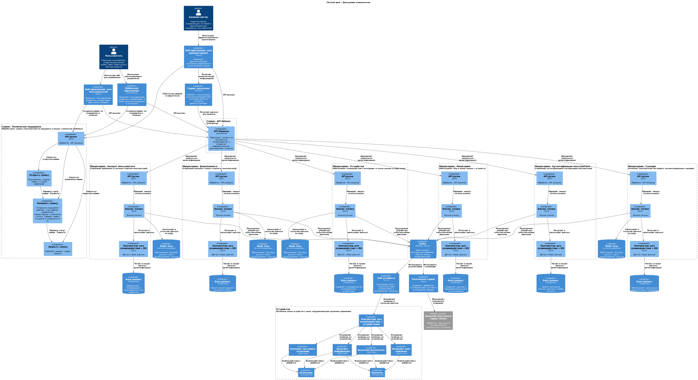

# Задание 1. Анализ и планирование

«Тёплый дом» — это компания, которая организует удалённое управление отоплением в доме.
Компания занимается созданием экосистемы умных посёлков на территории нескольких регионов страны.

На данном этапе развития бизнеса, есть острая необходимость расширить функционал своей системы и масштабировать её.
Экосистема должна позволить пользователям управлять не только отоплением, но и умными устройствами в доме. 
Чтобы подключить дом к экосистеме, пользователям необходимо установить специальные датчики и реле.

Состояние компании в настоящий момент не позволяет в полной мере реализовать новые бизнес-цели. 
Для этого требуется пересмотр и оптимизация всей экосистемы.

### 0. Текущее состояние системы и требования к системе после модернизации

#### Текущее решение
- Нынешнее приложение компании позволяет только управлять отоплением в доме и проверять температуру.
- Каждая установка сопровождается выездом специалиста по подключению системы отопления в доме к текущей версии системы.
- Архитектура приложения представляет из себя монолит на Java с СУБД Postgres. Всё синхронно. 
Никаких асинхронных вызовов, микросервисов и реактивного взаимодействия в системе нет. 
Всё управление идёт от сервера к датчику. Данные о температуре также получаются через запрос от сервера к датчику.
- Самостоятельно подключить свой датчик к системе пользователь не может.

#### Целевая экосистема, которую необходимо создать
- Экосистема доступна пользователю в режиме самообслуживания по модели SaaS.
- Система позволяет управлять отоплением, включать и выключать свет, запирать и отпирать автоматические ворота, 
удалённо наблюдать за домом. Также в будущем могут появиться запросы на добавление новой функциональности. 
Решение должно быть легко расширяемым.
- Пользователь самостоятельно выбирает необходимые ему модули умного дома (устройства), сам их подключает, 
настраивает сценарии работы и просматривает телеметрию.
- Компания не занимается производством устройств, но поддерживает подключение к экосистеме устройств партнёров 
по стандартным протоколам.
- Веб-разработка передана на аутсорс и не входит в требования данной работы.

##### Требования к экосистеме
- Модули управления приборами и сами приборы (устройства) должны быть максимально готовы к использованию и 
продаваться в отдельных комплектах для удобной покупки и подключения.
- Устройства должны быть доступны через интернет (для удалённого наблюдения и доступа). 
Предполагается, что пользователь будет иметь интернет-канал, к которому их можно подключить.
- Покупатели могут программировать систему для управления различными модулями в соответствии со своими потребностями.

#### Лэндскейп компании
Над проектом работают:
- Команда разработчиков. В ней пять человек. Они будут работать над рефакторингом и разделением монолита на микросервисы.
- Команда DevOps. В ней два человека. Они будут заниматься настройкой CI/CD-пайплайнов, контейнеризацией и оркестрацией.
- Команда QA. В ней три человека. Они будут проводить тестирование новой системы.
- Команда по обслуживанию клиентов. Их десять человек. Этих специалистов обучат работе с новой системой, 
чтобы они смогли предоставлять поддержку пользователям.
- Команда по продажам и маркетингу. Их пять человек. Они будут заниматься продвижением новых модульных комплектов.
Сейчас развёрнуто монолитное приложение на Java с PostgreSQL в качестве СУБД. У приложения 100 веб-клиентов, 
к системе подключены 100 модулей управления отоплением.

#### Цели бизнеса

##### Промежуточное состояние (через пару месяцев)
- Описана As-Is и To-Be архитектура решения. Создан план по переходу к целевой системе.
- Разработан MVP с разделёнными микросервисами для управления отоплением, освещением, наблюдением, воротами.

##### Финальное состояние (через год)
- Настроены CI/CD-пайплайны для автоматизации сборки и деплоя платформы экосистемы.
- Полностью развёрнута экосистема умного дома с модульной структурой.
- Платформа экосистемы готова к подключению до 100 экопоселков по 200 домов по пять устройств в каждом.
- Пользователи могут самостоятельно подключать новые модули, управлять ими через интернет и настраивать 
автоматические сценарии работы устройств.

### 1. Описание функциональности монолитного приложения

**Управление отоплением:**

Пользователи могут удалённо:
- Получать информацию о системе отопления в домах
- Изменять настройки в системе отопления в домах
- Включать/выключать отопление в своих домах.

Система поддерживает:
- Получение системы отопления с идентификатором {id}
- Обновление системы отопления с идентификатором {id}
- Включение системы отопления с идентификатором {id}
- Выключение системы отопления с идентификатором {id}

**Мониторинг температуры:**

Пользователи могут удалённо:
- Устанавливать целевую температуру для отопления в своих домах.
- Получать текущую температуру отопления в своих домах.

Система поддерживает:
- Установка целевой температуры на {temperature} для системы отопления с идентификатором {id}
- Получение текущей температуры для системы отопления с идентификатором {id}

### 2. Анализ архитектуры монолитного приложения

Язык программирования: Java
База данных: PostgreSQL
Архитектура: Монолитная, все компоненты системы (обработка запросов, бизнес-логика, работа с данными) находятся в рамках одного приложения.
Взаимодействие: Синхронное, запросы обрабатываются последовательно.
Масштабируемость: Ограничена, так как монолит сложно масштабировать по частям.
Развёртывание: Требует остановки всего приложения.

### 3. Определение доменов и границы контекстов

- Домен: управление устройствами умного дома
  - Поддомен: управление хабом
    - Контекст: подключение хаба в систему
    - Контекст: отправление команд с хаба на устройства
  - Поддомен: управление устройствами
    - Контекст: подключение устройства
    - Контекст: включение/выключение
    - Контекст: отслеживание датчиков
    - Контекст: получить информацию с устройства
    - Контекст: мониторинг устройства
  - Поддомен: управление устройствами от сторонних производителей
    - Контекст: подключение устройств от сторонних производителей в нашу систему
    - Контекст: отключение устройств от сторонних производителей в нашу систему
    - Контекст: синхронизация настоек устройств от сторонних производителей в нашу систему
- Домен: сценарии
  - Поддомен: управление сценариями
    - Контекст: создать команду (одно конкретное действие) в сценарии
    - Контекст: добавить условия в сценарий
    - Контекст: создать новый сценарий
    - Контекст: удалить сценарий
- Домен: личный кабинет пользователей
  - Поддомен: личный аккаунт пользователя
    - Контекст: регистрация пользователя
    - Контекст: настройка аккаунта пользователя
  - Поддомен: настройка дома
    - Контекст: создание дома
    - Контекст: привязка дома к аккаунту пользователя
    - Контекст: создание комнат в доме
    - Контекст: изменение комнат в доме
    - Контекст: удаление комнат в доме
- Домен: мониторинг работы устройств
  - Поддомен: работы устройств
    - Контекст: отслеживание местонахождения
    - Контекст: отслеживание работоспособности устройств и хаба
  - Поддомен: отчеты и аналитика
    - Контекст: сбор данных и формирование по ним отсчет
    - Контекст: анализ отчетов
- Домен: техническая поддержка
  - Поддомен: 1 линия поддержки (проблемы, решением которых будет достаточен ответ на вопрос)
    - Контекст: консультация по продуктам
    - Контекст: помощь при регистрации и настройке аккаунта
    - Контекст: помощь при подключении новых устройств
    - Контекст: помощь в выборе конкретных устройств
    - Контекст: помощь в выборе хаба(если у компании предполагается выбор)
    - Контекст: и прочие интересующие вопросы 
  - Поддомен: 2 линия поддержки (проблемы, решением которые требует полного знания системы и работы устройств)
    - Контекст: консультация ошибок при регистрации и настройки аккаунта
    - Контекст: консультация ошибок при подключении устройств
    - Контекст: консультация ошибок при работе хаба
    - Контекст: консультация ошибок в сценариях
  - Поддомен: 3 линия поддержки (проблемы, которые смогут решить только специалисты из разработки)
    - Контекст: выявления проблем, для решения которые необходимо изменять кодовую базу системы
- Домен: оплата за обслуживание
  - Поддомен: обработка платежей
    - Контекст: выполнение транзакций
    - Контекст: ведение журнала транзакций

### 4. Проблемы монолитного решения

**Масштабируемость**
Проблема в том, что текущее состояние системы не дает возможность добавить больше пользователей и подключить больше датчиков.
Если добавить больше новых пользователей, система будет жутко тормозить, запросы будет долго обрабатываться, 
сервис будет часто падать при новой нагрузке, придется вертикально расширять ресурсы, что потребует определенного 
бюджета в компании и тд. 
Все это скажется негативно на пользователей, когда они будут пользовать данным продуктом.
Будет негативный фитбек и скорей всего отток клиентов. 
Новые пользователи, скорей всего просто не будут продолжать пользоваться экосистемой «Тёплый дом».

**Подключение датчиков**
На текущем этапе, для установки новых датчиков, необходимо вызвать мастера. 
Для пользователей, данный подход является неудобным. Так как пользователю придется подстраиваться под работу мастера «Тёплый дом»,
дожидаться приезда и лично встречаться для настройки. В текущих реалиях это большой минус, которых вызывает дискомфорт от использования экосистемы «Тёплый дом».
Для компании это тоже огромный недостаток, тк придется держать отдельный штат мастеров, с увеличение клиентов, этот штат необходимо 
пропорционально расширять. Что в свою очередь несет только убытки компании.

**Развёртывание**
Внесение новых фичей требует остановку системы. Это критический недостаток, так как невозможно подобрать время для 
развертывания, не затрагивая пользователей.
Пользователи всегда могу менять настройки своего отопления, в любое время дня и ночи. И если они словят ошибку 500, 
для пользователя это будет звоночек, что лучше бы ему присмотреться к другой компании.

**Проблема в многообразии датчиков**
Текущая система ограничивает пользователей в выборе устройств умного дома. Я предполагаю, 
что на текущем этапе подключать новые датчики можно только от компании «Тёплый дом». Это ограничение может отпугнуть клиентов. 
Во-первых датчиков ограничено, отопление и температура. 
Во-вторых, для пользователя текущие датчики могут не удовлетворять потребностям. 
Для примера, один пользователь хочет подключить отопления для студии 18м, для его кейса система отопления будет переизбыточное. 
Клиент фактически будет переплачивать за купленное оборудование.
У второго пользователя есть дом 300м. И мощности может просто не хватить, либо придется купить большое количество систем отопления.
Для этого кейса гораздо экономичнее купить мощную систему отопления от сторонних брендов. Либо специально разработанную для подобной площади домов.
С такими условиями, клиент будет проще и экономичнее уйдет к конкурентам.

### 5. Визуализация контекста системы - диаграмма С4

**Диаграмма контекста (Context)**

[context_diagram.puml](diagrams/context/context_diagram.puml)

# Задание 2. Проектирование микросервисной архитектуры

**Диаграмма контейнеров (Containers)**

[container_diagram.puml](diagrams/container/container_diagram.puml)

**Диаграмма компонентов (Components)**

[component_diagram.puml](diagrams/component/component_diagram.puml)

**Диаграмма кода (Code)**

[code_diagram.puml](diagrams/code/code_diagram.puml)

# Задание 3. Разработка ER-диаграммы

[er_diagram.puml](diagrams/er-diagram/er_diagram.puml)

