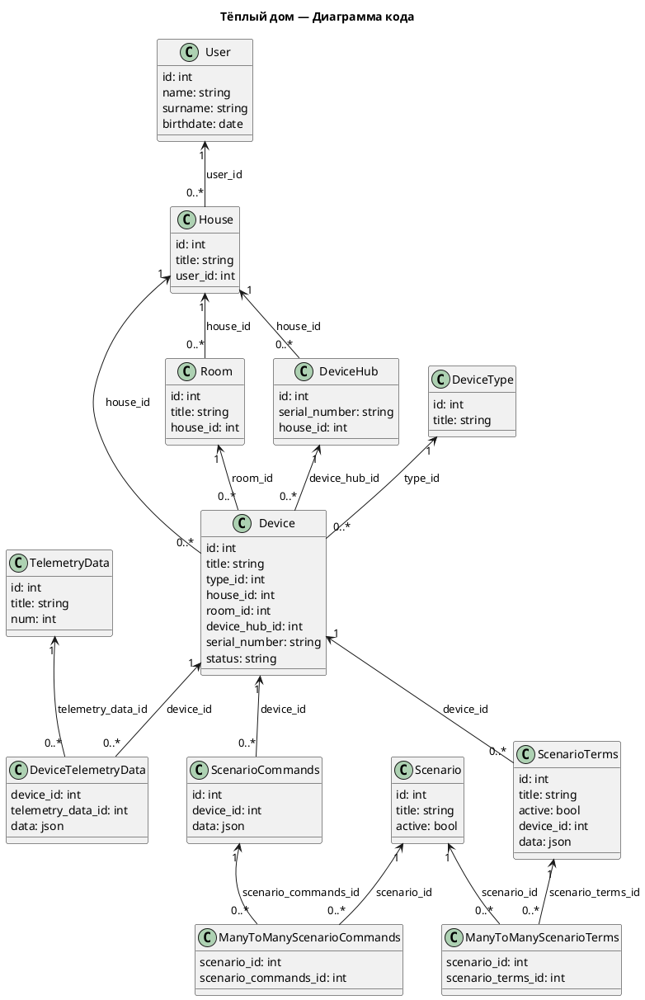

# Welcome to MkDocs

For full documentation visit [mkdocs.org](https://www.mkdocs.org).

## Commands

* `mkdocs new [dir-name]` - Create a new project.
* `mkdocs serve` - Start the live-reloading docs server.
* `mkdocs build` - Build the documentation site.
* `mkdocs -h` - Print help message and exit.

## Project layout

### Уровень 1. Диаграмма контекста — Context diagram
```puml
@startuml
title Тёплый дом — Диаграмма контекста

top to bottom direction

!includeurl https://raw.githubusercontent.com/RicardoNiepel/C4-PlantUML/master/C4_Component.puml

Person(user, "Пользователь", "Конечный пользователь, управляющий умным домом")
Person(admin, "Администратор", "Администратор, управляющий системой и поддержкой пользователей")
System(WarmHomeSystem, "Система «Тёплый дом»", "Система управления отоплением и умными устройствами")
System(devices, "Устройства", "Управляемые и подключенные устройства")

System_Ext(smartDevices, "Устройства умного дома", "Сторонние устройства, интегрируемые в систему", "Использует стандартные протоколы подключения")

Rel(user, WarmHomeSystem, "Управляет отоплением и устройствами")
Rel(admin, WarmHomeSystem, "Администрирует и поддерживает систему")
Rel(WarmHomeSystem, smartDevices, "Интегрирует устройства")
Rel(WarmHomeSystem, devices, "Контролирует и управляет устройствами")

@enduml
```

### Уровень 2. Диаграмма контейнеров — Container diagram
```puml
@startuml
title Тёплый дом — Диаграмма контейнеров

!includeurl https://raw.githubusercontent.com/RicardoNiepel/C4-PlantUML/master/C4_Component.puml

Person(user, "Пользователь", "Конечный пользователь, управляющий умным домом")
Person(admin, "Администратор", "Администратор, управляющий системой и поддержкой пользователей")

Container(app, "Мобильное приложение", "iOS/Android", "Позволяет пользователям управлять устройствами в доме")
Container(webUser, "Веб приложение для пользователей", "React", "Позволяет пользователям управлять устройствами в доме")
Container(webAdmin, "Веб приложение для администрации", "React", "Позволяет администраторам управлять системой")
Container(api, "API «Тёплый дом»", "Java/Spring", "Предоставляет функциональность системы «Тёплый дом»")
Container(supportService, "Сервис технической поддержки", "Java/Spring", "Обрабатывает запросы поддержки пользователей")
Container(analyticsService, "Сервис аналитики", "Python", "Анализ данных взаимодействия")
Container(serviceHub, "Хаб устройств", "C++", "Управление подключенными устройствами")
Container(devices, "Устройства", "Управляемые и подключенные устройства")
Container(paymentService, "Платежный сервис", "Java", "Обрабатывает платежи пользователей")

ContainerDb(redisDB, "Redis Кэш", "In-memory database", "Кэширование данных для быстрого доступа")
ContainerDb(postgresDB, "База данных PostgreSQL", "SQL Database", "Хранение данных пользователей и устройств")
ContainerQueue(kafkaQueue, "Kafka", "Message Queue", "Обработка событий и асинхронные коммуникации")

System_Ext(externalDevices, "Внешние системы умного дома", "Сторонние устройства", "Интеграция через стандартные протоколы")
System_Ext(paymentGateway, "Внешний платежный сервис (Банк)", "Обработка платежей")

Rel(user, app, "Использует для управления")
Rel(user, webUser, "Использует для управления")
Rel(admin, webAdmin, "Использует для администрирования")

Rel(app, supportService, "Поддержка")
Rel(app, api, "Использует")
Rel(webUser, supportService, "Поддержка")
Rel(webUser, api, "Использует")

Rel(webAdmin, supportService, "Поддержка")
Rel(webAdmin, analyticsService, "Использует")

Rel(analyticsService, api, "Запрос данных")

Rel(api, redisDB, "Кэширование данных")
Rel(api, postgresDB, "Хранение основных данных")
Rel(api, serviceHub, "Управление устройствами")
Rel(api, externalDevices, "Интеграция устройств")
Rel(api, paymentService, "Обработка платежей")
Rel(api, kafkaQueue, "Публикация и получение сообщений")
Rel(kafkaQueue, api, "Отправка сообщений")

Rel(paymentService, paymentGateway, "Обработка платежей")

Rel(serviceHub, devices, "Контроль и управление устройствами")

@enduml
```

### Уровень 3. Диаграмма компонентов — Component diagram
```puml
@startuml
title Тёплый дом — Диаграмма компонентов

!includeurl https://raw.githubusercontent.com/RicardoNiepel/C4-PlantUML/master/C4_Component.puml

Person(user, "Пользователь", "Конечный пользователь, управляющий умным домом через мобильные и веб-приложения")
Person(admin, "Администратор", "Администратор, управляющий системой и обеспечивающий поддержку пользователей")

Container(app, "Мобильное приложение", "iOS/Android", "Позволяет пользователям управлять устройствами в доме, включая освещение и отопление")
Container(webUser, "Веб приложение для пользователей", "React", "Позволяет пользователям управлять устройствами через веб-интерфейс")
Container(webAdmin, "Веб приложение для администрации", "React", "Позволяет администраторам системное управление и аналитический надзор")
Container(supportService, "Сервис технической поддержки", "Java/Spring", "Обрабатывает запросы пользователей на поддержку и решает технические проблемы")
Container(analyticsService, "Сервис аналитики", "Python", "Собирает и анализирует данные взаимодействий для представления инсайтов администраторам")
Container(paymentService, "Платежный сервис", "Java", "Управляет обработкой платежей через систему и интеграцию с банком")
Container(serviceHub, "Хаб устройств", "C++", "Взаимодействует с подключенными устройствами и распределяет команды")
Container(devices, "Устройства", "Различные умные устройства в доме, поддерживающие удаленное управление")

System_Ext(paymentGateway, "Внешний платежный сервис (Банк)", "Обработка транзакций для обеспечения безопасности платежей")

Rel(user, app, "Использует приложение для управления")
Rel(user, webUser, "Использует веб для управления")
Rel(admin, webAdmin, "Использует административное приложение")

Rel(app, supportService, "Запросы на поддержку и помощь")
Rel(webUser, supportService, "Запросы на поддержку и помощь")
Rel(webAdmin, supportService, "Запросы на поддержку и помощь")
Rel(webAdmin, analyticsService, "Получает аналитическую информацию")

Rel(paymentService, paymentGateway, "Производит платежные операции")
Rel(serviceHub, devices, "Отправляет команды и получает данные")

Boundary(internal, "Система «Тёплый дом»") {
  Component(apiGateway, "API Gateway", "Java/Spring", "Проксирует запросы ко внутренним микросервисам и управляет маршрутизацией")
  
  Component(authService, "Микросервис: Аутентификация пользователя", "Java/Spring", "Управление аутентификацией и авторизацией пользователей")
  Component(accountService, "Микросервис: Аккаунт пользователя", "Java/Spring", "Управление профилями и учетными записями пользователей")
  Component(homeRoomService, "Микросервис: Дома/комнаты", "Java/Spring", "Управление данными о домах и комнатах пользователей")
  Component(deviceService, "Микросервис: Устройства", "Java/Spring", "Обеспечивает взаимодействие и интеграцию со всеми умными устройствами")
  Component(scenarioService, "Микросервис: Сценари", "Java/Spring", "Позволяет пользователям настраивать автоматизированные сценарии")
  Component(monitoringService, "Микросервис: Мониторинг", "Java/Spring", "Обеспечивает сбор и анализ данных с устройств")

  Component(businessLogic, "Бизнес логика", "Java", "Содержит основные бизнес-правила и логику интеграций")
  ContainerDb(redisCache, "Redis Кэш", "In-memory database", "Обеспечивает быстрый доступ к часто запрашиваемым данным")
  ContainerQueue(kafkaQueue, "Kafka", "Message Queue", "Обеспечивает асинхронную обработку событий между микросервисами")

  ContainerDb(authDb, "База данных", "PostgreSQL", "Хранит данные об учетных записях и правах доступа")
  ContainerDb(accountDb, "База данных", "PostgreSQL", "Обрабатывает информацию о пользователях и их профилях")
  ContainerDb(homeRoomDb, "База данных", "PostgreSQL", "Хранит конфигурации и состояние комнат")
  ContainerDb(deviceDb, "База данных", "PostgreSQL", "Содержит информацию об установленных устройствам")
  ContainerDb(scenarioDb, "База данных", "PostgreSQL", "Обеспечивает данные для автоматизации сценариев")
  ContainerDb(monitoringDb, "База данных", "PostgreSQL", "Сохраняет данные о производительности и использовании")

  Rel(app, apiGateway, "API вызовы")
  Rel(webUser, apiGateway, "API вызовы")
  Rel(webAdmin, apiGateway, "API вызовы")

  Rel(apiGateway, authService, "Направляет запросы на аутентификацию")
  Rel(apiGateway, accountService, "Направляет запросы к пользователям")
  Rel(apiGateway, homeRoomService, "Обрабатывает информацию по домам")
  Rel(apiGateway, deviceService, "Распределяет команды между устройствами")
  Rel(apiGateway, scenarioService, "Передает рабочие сценарии")
  Rel(apiGateway, monitoringService, "Направляет запросы мониторинга")

  Rel(authService, authDb, "Читает и пишет данные аутентификации")
  Rel(accountService, accountDb, "Читает и пишет данные пользователей")
  Rel(homeRoomService, homeRoomDb, "Обрабатывает данные помещений")
  Rel(deviceService, deviceDb, "Читает и пишет данные устройств")
  Rel(scenarioService, scenarioDb, "Управляет данными сценариев")
  Rel(monitoringService, monitoringDb, "Читает данные мониторинга")

  Rel(authService, businessLogic, "Взаимодействует для правил доступа")
  Rel(accountService, businessLogic, "Взаимодействует для обслуживания профилей")
  Rel(homeRoomService, businessLogic, "Обрабатывает события и правила для комнат")
  Rel(deviceService, businessLogic, "Реализует логику взаимодействия устройств")
  Rel(scenarioService, businessLogic, "Передает для выполнения сценариев")
  Rel(monitoringService, businessLogic, "Интеграция мониторинга")

  Rel(businessLogic, kafkaQueue, "Обработка событий и обмен данными")
  Rel(kafkaQueue, businessLogic, "Получение событий и обмен данными")

  Rel(businessLogic, redisCache, "Кэширование данных")
  Rel(redisCache, businessLogic, "Обращение к кэшу")

  Rel(businessLogic, serviceHub, "Интеграция с устройствами")
  Rel(businessLogic, paymentService, "Интеграция с платежами")

  Rel(analyticsService, apiGateway, "Получает данные для анализа")
}

@enduml
```

### Уровень 4. Диаграмма кода — Code diagram

```puml
@startuml
title Тёплый дом — Диаграмма кода 

' Компонент API Gateway
class APIGateway {
  +routeRequest(request : Request)
  +authenticateRequest(request : Request)
  --
  -authService : AuthService
  -accountService : AccountService
  -homeRoomService : HomeRoomService
  -deviceService : DeviceService
  -scenarioService : ScenarioService
  -monitoringService : MonitoringService
}

' Компонент аутентификации
class AuthService {
  +authenticate(credentials : Credentials) : User
  +authorize(user : User, action : String) : boolean
  --
  -validateToken(token : string) : boolean
}

' Компонент управления аккаунтами
class AccountService {
  +createAccount(user : User) : Account
  +updateAccount(account : Account) : void
  --
  -sendWelcomeEmail(user : User)
}

' Компонент управления домами и комнатами
class HomeRoomService {
  +addHome(home : Home) : void
  +addRoom(room : Room) : void
  +getHomeDetails(homeId : UUID) : Home
  --
  -validateRoomConfig(room : Room) : boolean
}

' Компонент управления устройствами
class DeviceService {
  +registerDevice(device : Device) : void
  +updateDeviceStatus(deviceId : UUID, status : DeviceStatus) : void
  +monitorDevice(deviceId : UUID) : MonitoringData
  --
  -sendDeviceUpdateNotification(device : Device)
}

' Компонент управления сценариями
class ScenarioService {
  +createScenario(scenario : Scenario) : void
  +executeScenario(scenarioId : UUID) : void
  +listUserScenarios(userId : UUID) : List<Scenario>
  --
  -validateScenario(scenario : Scenario) : boolean
}

' Компонент мониторинга
class MonitoringService {
  +logDeviceData(deviceId : UUID, data : Data) : void
  +retrieveMonitoringData(deviceId : UUID) : MonitoringData
  +generateDeviceReport(deviceId : UUID) : String
  --
  -aggregateData(deviceId : UUID) : List<Data>
}

class Credentials {
  +username : String
  +password : String
}

class User {
  +userId : UUID
  +name : String
  +email : String
}


class Home {
  +homeId : UUID
  +address : String
  +rooms : List<Room>
}

class Room {
  +roomId : UUID
  +homeId : UUID
  +name : String
}

class Device {
  +deviceId : UUID
  +status : Bool
  +type : String
}

class Scenario {
  +scenarioId : UUID
  +userId : UUID
  +description : String
}

class MonitoringData {
  +deviceId : UUID
  +data : Data
}

APIGateway o-- AuthService
APIGateway o-- AccountService
APIGateway o-- HomeRoomService
APIGateway o-- DeviceService
APIGateway o-- ScenarioService
APIGateway o-- MonitoringService

AuthService ..> User
AccountService ..> User
HomeRoomService ..> Home
HomeRoomService ..> Room
DeviceService ..> Device
ScenarioService ..> Scenario

AuthService ..> Credentials
MonitoringService ..> MonitoringData

@enduml
```


### Разработка ER-диаграммы

